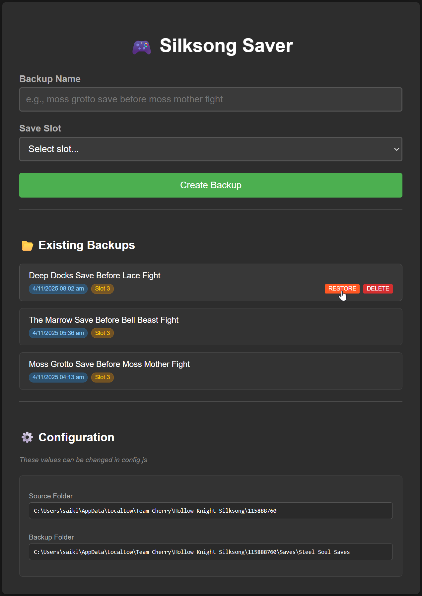

# 🤹‍♀️ Silksong Saver · Manage Unlimited Save Backups

[Download](../../releases) • [Report Bugs](../../issues)

A simple, local tool for managing **Hollow Knight: Silksong** (Steam) save backups. Access it locally (http://localhost:3000) from Steam's in-game browser or any browser.

While the game provides only four save slots, this tool lets you create unlimited named backups for experimentation, testing different routes, or preserving specific moments you want to revisit.

I haven't tested it, but this should work with **Hollow Knight** saves as well.



## ✨ Features

-   **Automatic save folder detection** based on your OS (Windows, macOS, Linux)
-   **Create backups** with custom names for each save slot
-   **View all backups** with timestamps and slot information
-   **Rename / Restore / Delete backups** directly from the displayed backup list
-   **Configuration display** with current (source and backup) folder paths

## 🚀 Quick Setup

You can either use the pre-built standalone executable or run the project from source.

### Use the standalone executable (Recommended)

1. **Download and extract** the zip file, for your OS, from the [latest release](../../releases/latest)

2. **Set up configuration (for save files' folder detection)**:

    Edit the `config` file, and update the `SAVE_USER_ID` variable with your Steam User ID, which can be found [here](https://steamcommunity.com/my/friends/add) as "Your Friend Code". For non-Steam builds, use `default` (see the "PC Save File Locations" FAQ [here](https://hollowknightsilksong.com/help)).

    ```env
    SAVE_USER_ID="YOUR_STEAM_USER_ID_HERE"
    ```

3. **Run the executable**

4. **Open in a (Steam or any) browser**: `http://localhost:3000`

### Run from Source

1. **Install Node.js (v20.6.0 or higher)**: Download from [nodejs.org](https://nodejs.org)

2. **Clone and install dependencies**:

    ```bash
    git clone --depth 1 https://github.com/saiki-k/silksong-saver.git
    cd silksong-saver
    npm install
    ```

3. **Set up configuration (for save files' folder detection)**:

    Make a copy of the .env.example file, and rename it to .env.

    ```bash
    cp .env.example .env
    ```

    In the newly created .env file, update the `SAVE_USER_ID` variable with your Steam User ID, which can be found [here](https://steamcommunity.com/my/friends/add) as "Your Friend Code". For non-Steam builds, use `default` (see the "PC Save File Locations" FAQ [here](https://hollowknightsilksong.com/help)).

    ```env
    SAVE_USER_ID="YOUR_STEAM_USER_ID_HERE"
    ```

4. **Start the server**: `npm start`

5. **Open in a (Steam or any) browser**: `http://localhost:3000`

## ⚙️ Backup Configuration

Whether using the executable or running from source, customize your backup strategy by editing the configuration file (`config` for executable, `.env` for source):

-   **Option A**: Store backups inside the game's save folder (recommended if you want your backups to be synced with Steam Cloud)

    This is the default configuration (no additional changes needed, apart from setting the `SAVE_USER_ID`) - your backups will be stored in a folder named `Save Backups` inside the game's save folder.

    ```env
    # Configuration for Option A
    SAVE_USER_ID="YOUR_STEAM_USER_ID_HERE"
    ```

    To customize the backup folder names within the game's save folder, you can set `RELATIVE_BACKUP_FOLDER` and `RELATIVE_BACKUP_SUBFOLDER` (optional) in the configuration file.

    <p align="center" style="margin: 20px 0;">• • •</p>

    > 💡 **Steam Cloud**
    >
    > **Sync**: If your Steam Cloud is active, using _Option A_ keeps your backups within the game's save directory, while ensuring they're automatically synced across devices via [Steam Cloud](https://store.steampowered.com/account/remotestorageapp/?appid=1030300).
    >
    > ⚠️ **Steam Cloud Gotchas**
    >
    > **Sync timing**: Always perform backup operations (rename/delete) while the game is running. If you modify backups while the game is closed, Steam may detect "missing" files and resync stale files when the game launches.
    >
    > **Storage limits**: Steam Cloud provides limited storage space (approximately 100 MB per game). If you plan to maintain a large number of backups (say, 50+), consider using _Option B_ with a custom backup folder, to avoid exceeding your Steam Cloud quota.

---

-   **Option B**: Store backups inside a custom folder

    Set the `BACKUP_FOLDER` variable in the configuration file to your desired backup location. This can be any valid folder path on your system.

    ```env
    # Configuration for Option B
    SAVE_USER_ID="YOUR_STEAM_USER_ID_HERE"
    BACKUP_FOLDER="C:\Users\YourUserName\Documents\Silksong Save Backups"
    ```

    <p align="center" style="margin: 20px 0;">• • •</p>

    > 💡 **Tip**
    >
    > You can set `BACKUP_FOLDER` using a relative path. Paths are resolved relative to the executable location (or project root if running from source).
    >
    > ```env
    > # BACKUP_FOLDER using a relative path
    > BACKUP_FOLDER="./Save Backups"
    > ```

## 🔨 Building from Source

Run the following command to create a standalone executable.

```bash
npm run build
```

The executable will be created in the `build/` directory. Requires Node.js v20.6.0 or higher.

## 📖 Usage

-   Run the executable (or `npm start` if running from source) before starting the game
-   Access via Steam's in-game web browser (Shift+Tab → Web Browser), or any web browser at `http://localhost:3000`
-   Create backups as needed during gameplay, after sitting at a bench
-   **Restore a backup**: Select a backup and restore it (replaces the current save file)
    > 📝 After restoring a backup, you must exit and restart the game for changes to take effect
